# awesome-hermes-eva-skins

简体中文 | [English](docs/README_en.md)

把你的 Hermes Agent 塞进 NERV 控制室：一组 EVA 风格皮肤，配套 Windows Terminal 的复古 CRT 配置。

## 皮肤预览

| EVA-00 | EVA-01 |
| --- | --- |
| 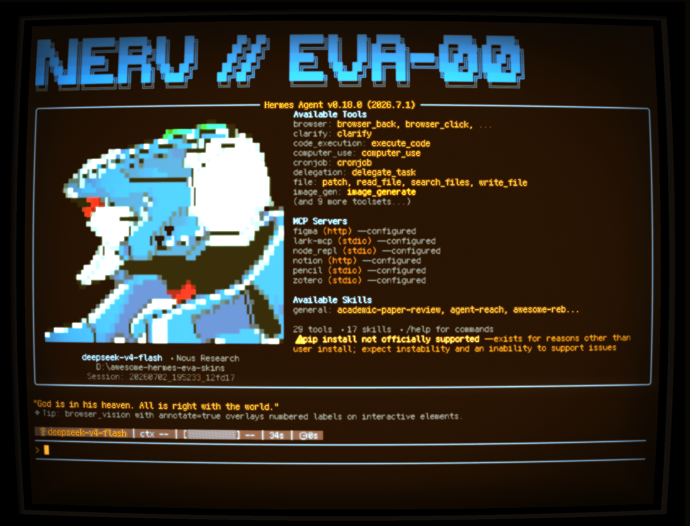 | 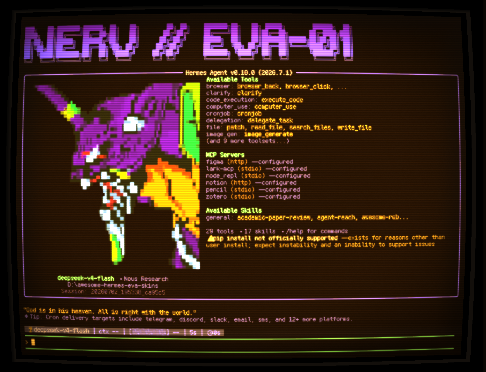 |
| EVA-02 | NERV Agent |
| 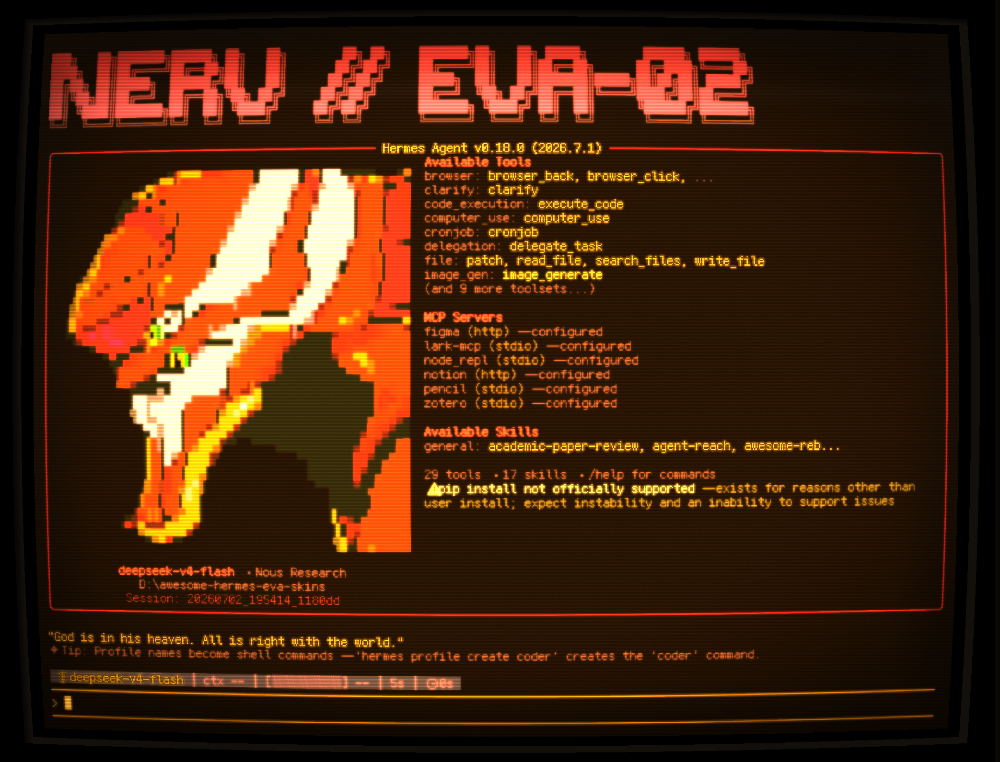 | 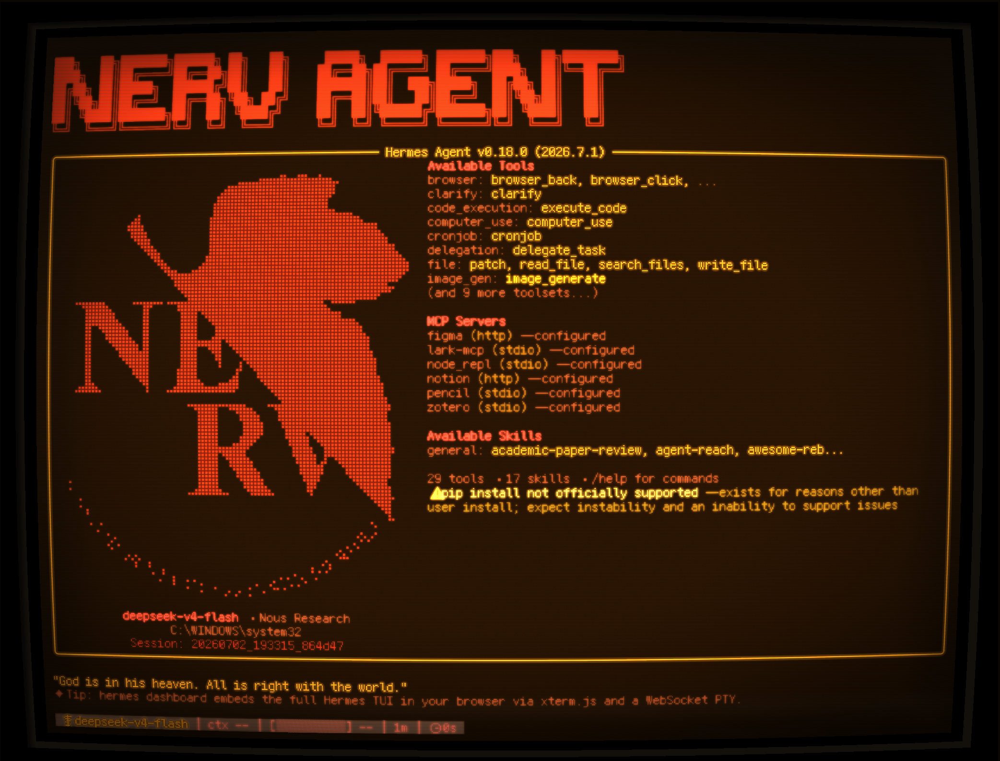 |

## HLSL 效果对比

| 场景 | `cool-retro-frame-amber.hlsl` | `cool-retro-frame-readable.hlsl` |
| --- | --- | --- |
| README / 长文本 | 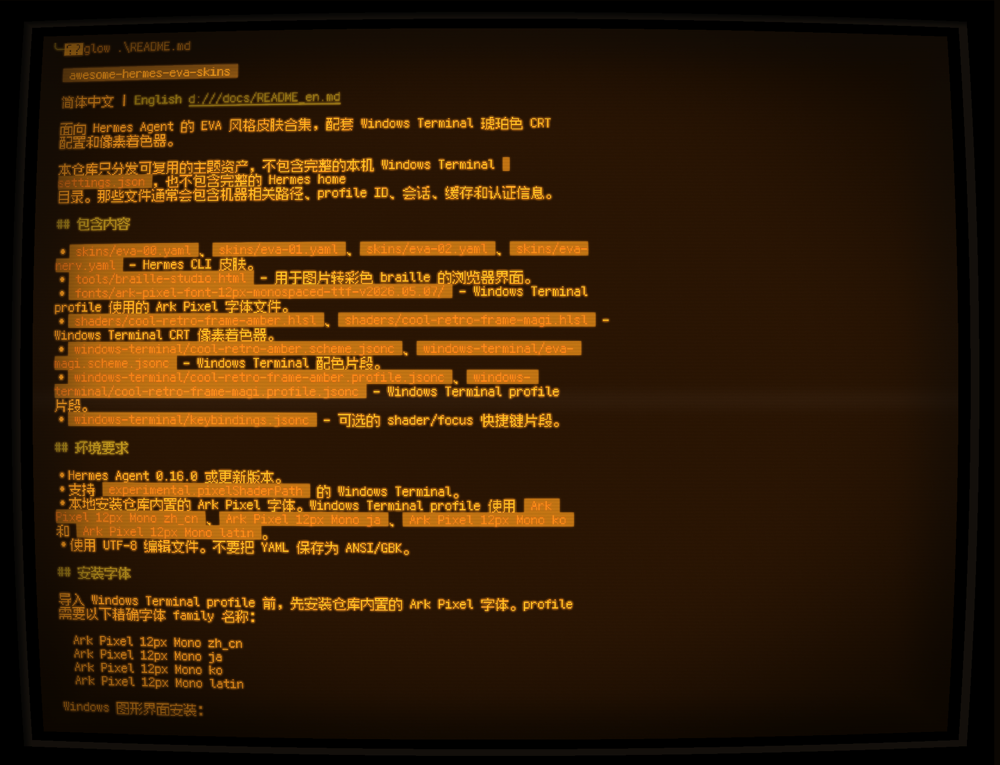 | 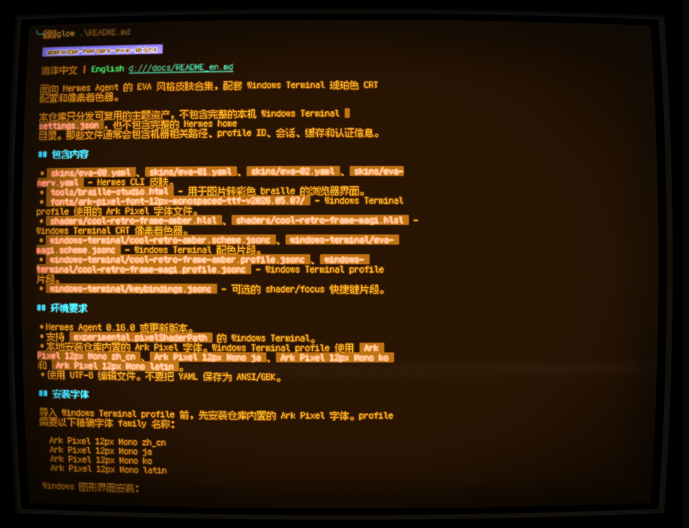 |
| NERV / 单色主题 | 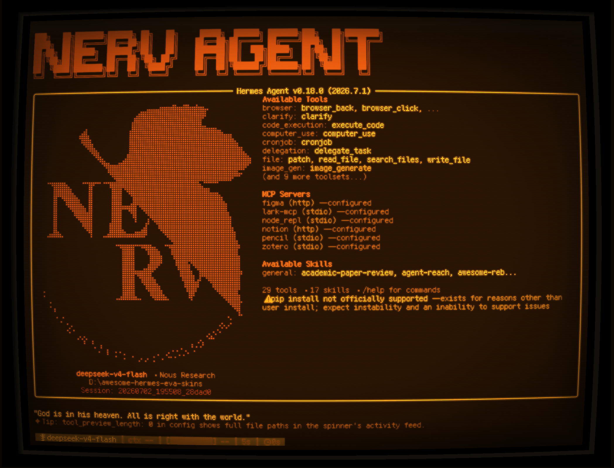 |  |

- `cool-retro-frame-amber.hlsl`（更风格化，终端大部分颜色会被映射为琥珀色）：更强的琥珀色统一映射、CRT 辉光和复古氛围，适合展示、录屏、截图、NERV 单色主题，以及想要整屏更像老式终端的时候。
- `cool-retro-frame-readable.hlsl`（适合一般人的推荐配置，尽可能保留终端命令颜色）：保留更多原始色相和高亮差异，适合长时间阅读 README、代码、日志、命令输出和多色 banner 调试。

> **如果对终端的显示效果不满意需要微调**，可以把 HLSL 文件以及 [Hammster/windows-terminal-shaders](https://github.com/Hammster/windows-terminal-shaders) 扔给你的 agent 做参考，让它帮你修改。
>
> **如果想要自己定制 Hermes 主题中的更多内容**，比如配色、状态指示图标和文案，可以使用 [cocktailpeanut/hermes-mod](https://github.com/cocktailpeanut/hermes-mod) 可视化调整。生成配置之后，建议让 agent 帮你整合进仓库里的主题 YAML；不要直接使用 hermes-mod 生成的完整配置，因为它暂时只会生成单色的 Hermes Agent 启动窗口标题和 hero，无法实现这个仓库里的多彩效果。


## 包含内容

- `skins/eva-00.yaml`、`skins/eva-01.yaml`、`skins/eva-02.yaml`、`skins/eva-nerv.yaml` - Hermes CLI 皮肤。
- `tools/braille-studio.html` - 用于图片转彩色 braille 的浏览器界面。
- `fonts/ark-pixel-font-12px-monospaced-ttf-v2026.05.07/` - Windows Terminal profile 使用的 Ark Pixel 字体文件。
- `shaders/cool-retro-frame-amber.hlsl`、`shaders/cool-retro-frame-readable.hlsl` - Windows Terminal CRT 像素着色器。
- `windows-terminal/cool-retro-amber.scheme.jsonc` - Windows Terminal 配色片段。
- `windows-terminal/cool-retro-frame-amber.profile.jsonc`、`windows-terminal/cool-retro-frame-readable.profile.jsonc` - Windows Terminal profile 片段。
- `windows-terminal/keybindings.jsonc` - 可选的 shader/focus 快捷键片段。
- `scripts/install-windows.ps1` - Windows 当前用户一键安装脚本，自动安装 TTF、Hermes YAML、HLSL 和 Windows Terminal profile。

## 环境要求

- Hermes Agent。
- 支持 `experimental.pixelShaderPath` 的 Windows Terminal。
- 本地安装仓库内置的 Ark Pixel 字体。Windows Terminal profile 使用 `Ark Pixel 12px Mono zh_cn`、`Ark Pixel 12px Mono ja`、`Ark Pixel 12px Mono ko` 和 `Ark Pixel 12px Mono latin`。
- 使用 UTF-8 编辑文件。不要把 YAML 保存为 ANSI/GBK。

## 安装方式 1：最简单自动化安装版

适合第一次使用、只想快速装好的用户。这个脚本只写当前用户目录，不需要管理员权限；修改 Windows Terminal `settings.json` 前会自动生成 `.bak-时间戳` 备份。

先克隆仓库：

```powershell
git clone https://github.com/Chael-Chael/awesome-hermes-eva-skins.git
cd awesome-hermes-eva-skins
```

先试跑，确认将要改哪些位置：

```powershell
powershell -NoProfile -ExecutionPolicy Bypass -File .\scripts\install-windows.ps1 -DryRun
```

确认无误后执行安装：

```powershell
powershell -NoProfile -ExecutionPolicy Bypass -File .\scripts\install-windows.ps1
```

脚本会自动完成：

1. 安装仓库内置的四个 Ark Pixel `.ttf` 字体到当前用户字体目录。
2. 把 `skins/*.yaml` 复制到 Hermes 皮肤目录，默认启用 `eva-02`。
3. 把 `shaders/*.hlsl` 复制到 `%LOCALAPPDATA%\WindowsTerminalShaders`。
4. 找到真实的 Windows Terminal `settings.json`，合并 `Cool Retro Amber` 配色、`Cool Retro Frame Amber` 和 `Cool Retro Frame Readable` 两个 PowerShell profile，以及 `Shift+F10`/`Shift+F11` 快捷键。

安装后：

1. 重启 Windows Terminal。
2. 在 Windows Terminal 的下拉菜单里打开 `Cool Retro Frame Amber` 或 `Cool Retro Frame Readable`。

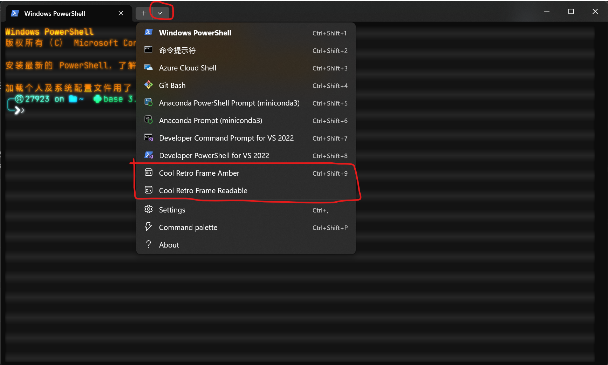

3. 如果想让新标签页默认进入该配置，打开 `Settings` -> `Startup`，把 `Default profile` 改成 `Cool Retro Frame Amber` 或 `Cool Retro Frame Readable`，然后保存。

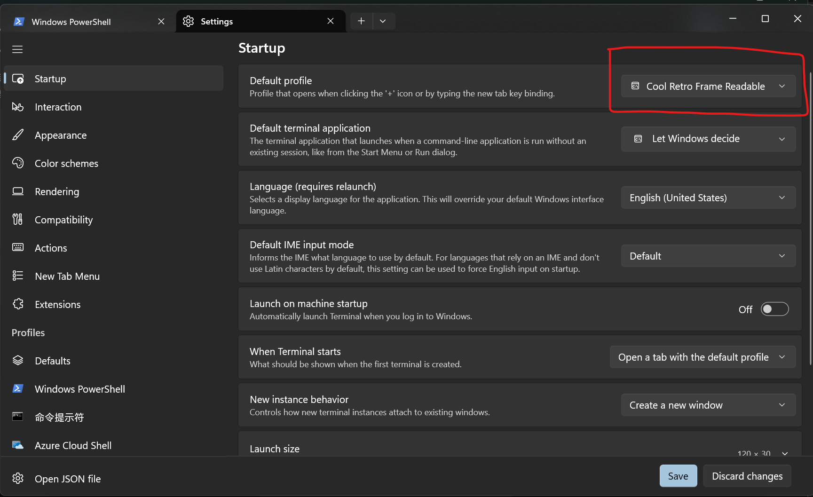

4. 启动 Hermes。如果脚本没有找到 `hermes` 命令，在 Hermes 里手动输入：

```text
/skin eva-02
```

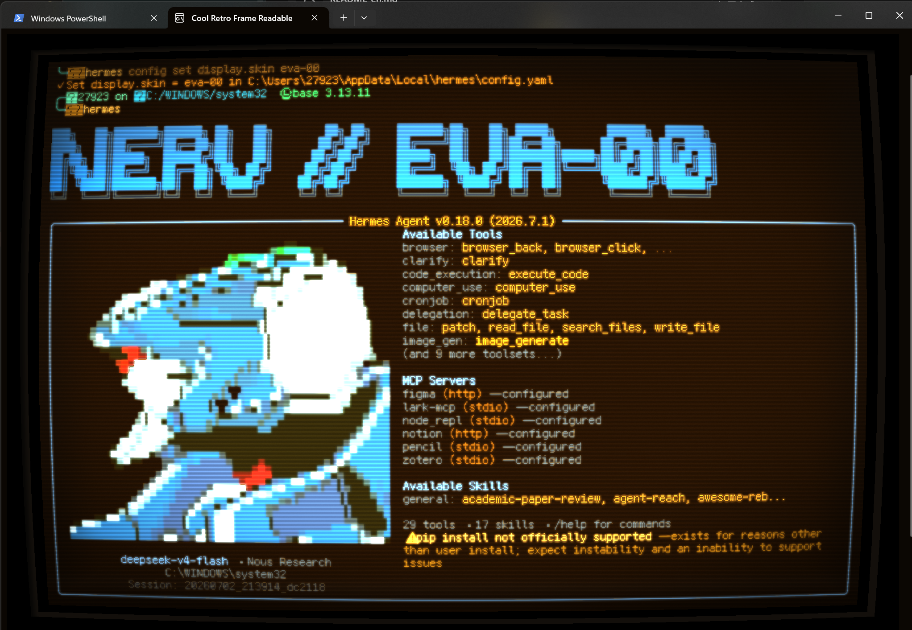

常用选项：

```powershell
# 只安装琥珀版 Windows Terminal profile
powershell -NoProfile -ExecutionPolicy Bypass -File .\scripts\install-windows.ps1 -Theme Amber

# 只安装可读版 Windows Terminal profile
powershell -NoProfile -ExecutionPolicy Bypass -File .\scripts\install-windows.ps1 -Theme Readable

# 默认 Hermes 皮肤改成 eva-01
powershell -NoProfile -ExecutionPolicy Bypass -File .\scripts\install-windows.ps1 -Skin eva-01

# 只安装 Hermes YAML，不改字体和 Windows Terminal
powershell -NoProfile -ExecutionPolicy Bypass -File .\scripts\install-windows.ps1 -SkipFonts -SkipWindowsTerminal
```

脚本不会自动安装 Hermes Agent 或 Windows Terminal 本体。如果找不到 Windows Terminal `settings.json`，先打开一次 Windows Terminal，再重新运行脚本。

## 安装方式 2：手动安装版

手动安装适合想看清楚每一步改了什么、或者需要把配置复制到自定义路径的用户。

### 第 1 步：安装 TTF 字体

导入 Windows Terminal profile 前，先安装仓库内置的 Ark Pixel 字体。profile 需要以下精确字体 family 名称：

```text
Ark Pixel 12px Mono zh_cn
Ark Pixel 12px Mono ja
Ark Pixel 12px Mono ko
Ark Pixel 12px Mono latin
```

Windows 图形界面安装：

1. 打开 `fonts/ark-pixel-font-12px-monospaced-ttf-v2026.05.07/`。
2. 选中四个 `.ttf` 文件。
3. 右键选择 `Install` 或 `Install for all users`。
4. 重启 Windows Terminal。

PowerShell 当前用户安装：

```powershell
$fontSource = ".\fonts\ark-pixel-font-12px-monospaced-ttf-v2026.05.07"
$fontDest = "$env:LOCALAPPDATA\Microsoft\Windows\Fonts"
$fontReg = "HKCU:\Software\Microsoft\Windows NT\CurrentVersion\Fonts"

New-Item -ItemType Directory -Force $fontDest | Out-Null
New-Item -Path $fontReg -Force | Out-Null

$fonts = @{
  "Ark Pixel 12px Mono latin (TrueType)" = "ark-pixel-12px-monospaced-latin.ttf"
  "Ark Pixel 12px Mono zh_cn (TrueType)" = "ark-pixel-12px-monospaced-zh_cn.ttf"
  "Ark Pixel 12px Mono ja (TrueType)" = "ark-pixel-12px-monospaced-ja.ttf"
  "Ark Pixel 12px Mono ko (TrueType)" = "ark-pixel-12px-monospaced-ko.ttf"
}

foreach ($entry in $fonts.GetEnumerator()) {
  Copy-Item (Join-Path $fontSource $entry.Value) (Join-Path $fontDest $entry.Value) -Force
  New-ItemProperty -Path $fontReg -Name $entry.Key -Value $entry.Value -PropertyType String -Force | Out-Null
}
```

如果 banner 显示成方块、回退成普通等宽字体，或者 ASCII art 明显错位，通常是字体未安装，或 Windows Terminal 还没有重启。

这一步的作用：让 Windows Terminal 能找到 EVA profile 指定的像素字体。没有这一步，终端仍能打开，但 banner、中文、日文、韩文和像素字符可能会显示成方块或错位。

### 第 2 步：安装 Hermes YAML 皮肤

克隆本仓库，然后把皮肤复制到 Hermes 皮肤目录：

```powershell
git clone https://github.com/Chael-Chael/awesome-hermes-eva-skins.git
cd awesome-hermes-eva-skins

New-Item -ItemType Directory -Force "$env:LOCALAPPDATA\hermes\skins"
Copy-Item ".\skins\eva-02.yaml" "$env:LOCALAPPDATA\hermes\skins\eva-02.yaml"
```

启动 Hermes 并切换皮肤：

```text
hermes
/skin eva-02
```

如果不想使用交互命令，也可以直接持久化配置：

```powershell
hermes config set display.skin eva-02
```

Hermes 也支持 `HERMES_HOME`。如果你使用自定义 Hermes home，请把 YAML 复制到：

```text
%HERMES_HOME%\skins\eva-02.yaml
```

这一步的作用：把 Hermes 能识别的皮肤文件放到 Hermes home。`eva-02.yaml` 是默认推荐皮肤；你也可以复制并启用 `eva-00.yaml`、`eva-01.yaml` 或 `eva-nerv.yaml`。

### 第 3 步：安装 Windows Terminal HLSL 视觉效果

把 shader 复制到稳定的本地目录：

```powershell
$shaderDir = "$env:LOCALAPPDATA\WindowsTerminalShaders"
New-Item -ItemType Directory -Force $shaderDir
Copy-Item ".\shaders\cool-retro-frame-amber.hlsl" "$shaderDir\cool-retro-frame-amber.hlsl"
Copy-Item ".\shaders\cool-retro-frame-readable.hlsl" "$shaderDir\cool-retro-frame-readable.hlsl"
```

打开 Windows Terminal settings JSON：

1. 打开 Windows Terminal。
2. 按 `Ctrl+,`。
3. 点击 `Open JSON file`。

然后编辑三个部分：

1. 把 `windows-terminal/cool-retro-amber.scheme.jsonc` 中的对象加入顶层 `schemes` 数组。
2. 把 `windows-terminal/cool-retro-frame-amber.profile.jsonc` 和 `windows-terminal/cool-retro-frame-readable.profile.jsonc` 中的对象加入 `profiles.list`。
3. 在两个 profile 中，把 `experimental.pixelShaderPath` 替换为你的真实 shader 路径，例如：

```jsonc
"experimental.pixelShaderPath": "C:\\Users\\you\\AppData\\Local\\WindowsTerminalShaders\\cool-retro-frame-amber.hlsl"
```

```jsonc
"experimental.pixelShaderPath": "C:\\Users\\you\\AppData\\Local\\WindowsTerminalShaders\\cool-retro-frame-readable.hlsl"
```

可选：根据你的 Windows Terminal settings schema，把 `windows-terminal/keybindings.jsonc` 中的条目加入顶层 `keybindings` 或 `actions` 数组。

这一步的作用：创建两个新的 Windows Terminal PowerShell profile。`experimental.pixelShaderPath` 指向 HLSL 文件，负责 CRT 外框、扫描线、辉光和琥珀色映射；`colorScheme` 指向配色；`commandline` 指向 Windows PowerShell。这里配置的是 Windows Terminal 的 profile，不是 PowerShell 的 `$PROFILE` 启动脚本。

Amber profile 使用：

Windows Terminal 图形界面里，先进入目标 profile 的 `Additional settings`，点击 `Appearance`：

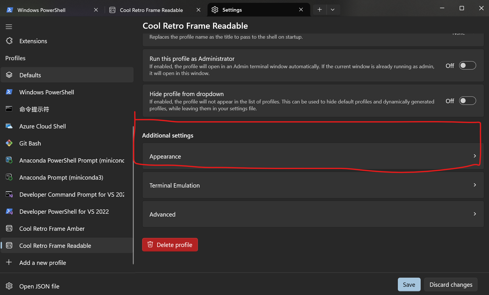

进入 `Appearance` 后，PowerShell profile 的关键设置可以参考下面两张截图：字体、字号、配色、光标、透明度、内边距和滚动条需要与 JSON 片段保持一致。

| Text settings | Appearance settings |
| --- | --- |
| 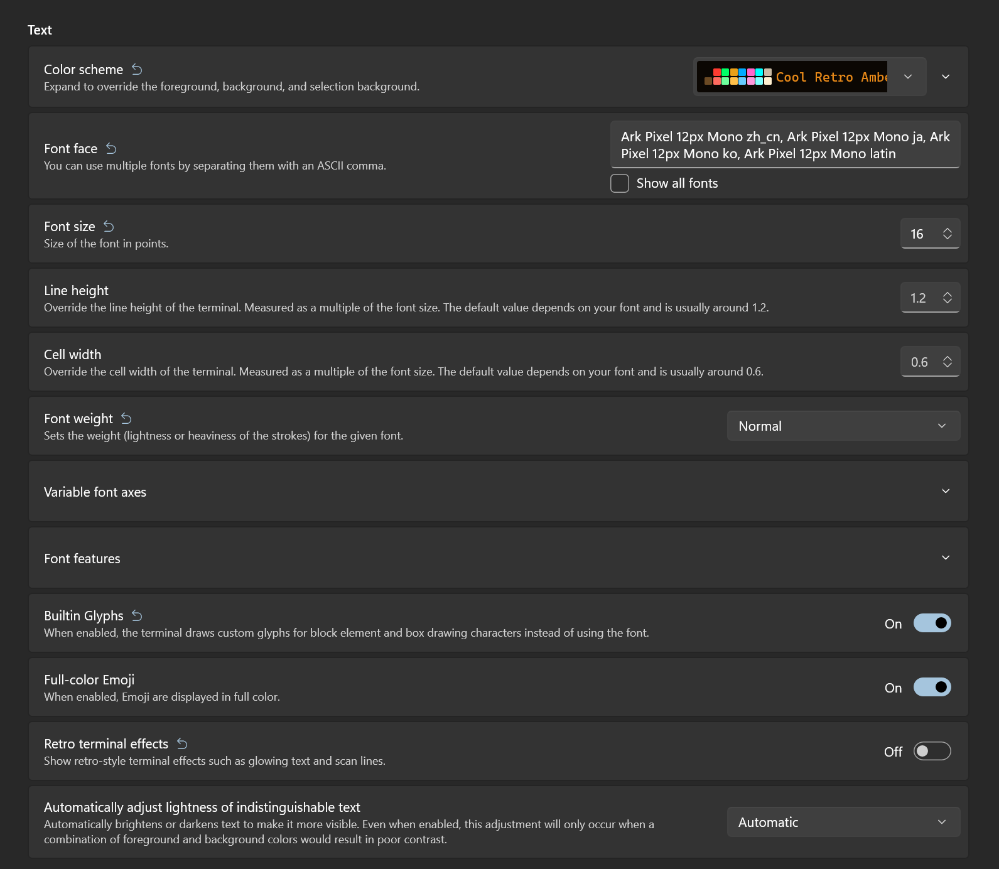 | 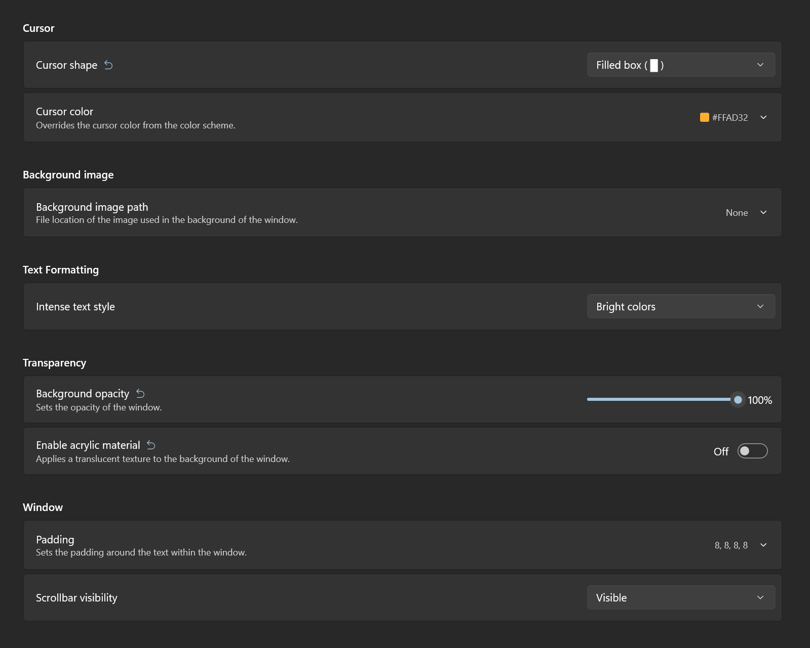 |

```jsonc
{
  "antialiasingMode": "aliased",
  "colorScheme": "Cool Retro Amber",
  "cursorShape": "filledBox",
  "experimental.retroTerminalEffect": false,
  "font": {
    "builtinGlyphs": true,
    "size": 16
  },
  "opacity": 100,
  "useAcrylic": false
}
```

## 从图片生成彩色 banner hero

本仓库包含一个小转换器，灵感来自 [`cocktailpeanut/hermes-mod`](https://github.com/cocktailpeanut/hermes-mod) 的 braille 图片渲染器。它会把每个 2x4 图像像素块映射为一个 Unicode braille 字符，然后根据源图像采样到的颜色，把该字符包进 Rich 前景色标记。终端只能给一个 braille 字符应用一个前景色，因此颜色精度是 2x4 braille cell 级别，而不是同一个字符内 8 个子点分别独立上色。

安装依赖：

```powershell
python -m pip install -r requirements.txt
```

生成 YAML `banner_hero` block：

```powershell
python .\scripts\image_to_rich_braille.py `
  "C:\path\to\eva-head.png" `
  --width 44 `
  --format yaml `
  --output ".\screenshots\eva-head-banner-hero.yaml"
```

对于 GIF 输入，可以用 `--frame` 渲染指定帧：

```powershell
python .\scripts\image_to_rich_braille.py `
  "C:\path\to\eva-heads.gif" `
  --frame 2 `
  --width 44 `
  --output ".\screenshots\eva-02-banner-hero.yaml"
```

对于低色彩像素画和纯色背景图，使用 pixel-art 保真模式。100 px 宽的源图固定使用 `--width 50`，可以做严格 2x4 映射：

```powershell
python .\scripts\image_to_rich_braille.py `
  "C:\path\to\eva-pixel-art.png" `
  --dot-mode pixel-art `
  --width 50 `
  --bg-color "#14171c" `
  --bg-tolerance 28 `
  --output ".\screenshots\eva-pixel-art-banner-hero.yaml"
```

对于白底像素画，请显式把背景设为白色。白色和近白色像素会被视为空白，黑色轮廓会优先用 `--ink-color` 渲染，剩余区域再使用原图填充色：

```powershell
python .\scripts\image_to_rich_braille.py `
  "C:\path\to\eva-white-bg.png" `
  --dot-mode pixel-art `
  --width 50 `
  --bg-color "#ffffff" `
  --bg-tolerance 28 `
  --outline-radius 0 `
  --ink-color "#2a3038" `
  --neutral-color "#8f98a8" `
  --output ".\screenshots\eva-white-bg-banner-hero.yaml"
```

`--outline-radius 0` 会保留原图已有的深色墨线点位，但不额外膨胀边缘。像素画模式会先判断 cell 里是否存在近黑轮廓；只有轮廓占比足够，或这一格没有彩色填充时，才整格使用 `--ink-color`，否则优先保留彩色填充。`--neutral-color` 控制灰色机械细节；`#2a3038` 是偏冷深灰，能让轮廓从深色背景里浮出来，但仍然保持描边层的低调权重。

默认前景 mask 会自动检测透明图片。对于不透明图片，它会把边缘最常见颜色视为背景。如果你知道图片背景色，建议显式传入：

```powershell
python .\scripts\image_to_rich_braille.py `
  "C:\path\to\eva-head.png" `
  --bg-color "#14171c" `
  --bg-tolerance 28 `
  --width 44
```

## HLSL 色彩映射逻辑

`shaders/cool-retro-frame-amber.hlsl` 不直接保留 Windows Terminal 的原始 RGB 颜色，而是先把终端画面重映射到一套琥珀色 CRT 调色逻辑里。

核心函数是 `ConvertWithChroma(sourceColor.rgb)`：

1. 先用 `Luma()` 计算输入颜色亮度：

```hlsl
dot(color, float3(0.21f, 0.72f, 0.04f))
```

这里绿色权重最高，所以终端原图里越亮、越偏绿色感知亮度越高的像素，会被视为更接近“发光文字”。

2. 用亮度把画面拆成“背景”和“前景”两端：

```hlsl
return lerp(CRT_BACKGROUND_COLOR, foreground, saturate(grey));
```

暗像素靠近 `CRT_BACKGROUND_COLOR`，亮像素靠近 `foreground`。当前背景是偏深棕橙的 `float3(0.150f, 0.075f, 0.012f)`，默认文字磷光色是 `CRT_FONT_COLOR = float3(1.000f, 0.620f, 0.105f)`。

3. `foreground` 不是纯固定琥珀色，而是混入少量原始色相：

```hlsl
float3 chromaForeground = sourceColor * CRT_FONT_COLOR / denom;
float3 foreground = lerp(CRT_FONT_COLOR, chromaForeground, CRT_CHROMA);
```

`CRT_CHROMA` 当前是 `0.20f`，意思是大约 80% 走统一琥珀色，20% 保留原始颜色的相对差异。这样普通文本会保持复古琥珀主色，但彩色 banner、语法高亮或 UI 色块仍会带一点原始色彩层次。

主流程里还会对映射后的颜色继续加工：

- `CRT_SCREEN_BRIGHTNESS` 把整体亮度提高到 `1.3f`。
- `CRT_BLACK_FLOOR` 给暗部设置最低黑位，避免完全死黑。
- `Blur()` 采样周围像素后再次走 `ConvertWithChroma()`，叠加成文字辉光。
- 径向采样红蓝边缘亮度差，叠加一点 `RGB_ABERRATION_STRENGTH`，制造轻微色散。
- 最后再加扫描线、噪点、刷新线、曲面暗角和外框。

所以当前 shader 的颜色策略可以概括为：用原始画面的亮度决定“背景到琥珀前景”的位置，用 `CRT_CHROMA` 少量保留原始色相，再通过辉光、黑位、色散和扫描线把结果压成 CRT 琥珀屏风格。

## 故障排查

- 屏幕颜色正常但没有 CRT 效果：检查 `experimental.pixelShaderPath`，如果安装了快捷键，也可以按 `Shift+F10` 切换 shader。
- banner 乱码或错位：安装推荐字体，并确认 `skins/eva-02.yaml` 保存为 UTF-8。
- Windows Terminal 无法加载 settings：检查向 `schemes`、`profiles.list` 或 `keybindings` 添加对象后是否缺少逗号。
- shader 太慢：按 `Shift+F10` 关闭 shader，或者从 profile 中移除 `experimental.pixelShaderPath`。

## 致谢

本项目受以下项目启发，并旨在与它们良好配合：

- [cocktailpeanut/hermes-mod](https://github.com/cocktailpeanut/hermes-mod) - Hermes 皮肤管理和视觉编辑工作流。
- [Hammster/windows-terminal-shaders](https://github.com/Hammster/windows-terminal-shaders) - 用于实现复古 CRT 视觉的 Windows Terminal shader 效果。
- [Cronos - "The EVA'S - Neon Genesis Evangelion."](https://pixeljoint.com/pixelart/151379.htm) - EVA 机体侧脸像素画参考。

shader 归属说明见 `THIRD_PARTY_NOTICES.md`。
